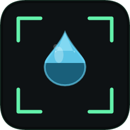

<div align="center">



# HydroShot

A fast, lightweight screenshot capture and annotation tool.
Built with Rust, winit, and tiny-skia.

<p>
  <a href="#features">Features</a> &bull;
  <a href="#installation">Installation</a> &bull;
  <a href="#usage">Usage</a> &bull;
  <a href="#configuration">Configuration</a> &bull;
  <a href="#development">Development</a> &bull;
  <a href="#license">License</a>
</p>

</div>

---

## Features

### Capture

- **Region selection** — Click and drag to capture any area of your screen. Resize and reposition selections before committing.
- **Window capture** — Highlight and click any window to capture it instantly.
- **Delay capture** — Timed captures (3s, 5s, 10s) with a visible countdown overlay, giving you time to set up the shot.
- **Multi-monitor support** — Captures the entire virtual desktop across all connected monitors.
- **Fullscreen overlay** — Semi-transparent overlay dims inactive areas for precise region selection.

### Annotation Tools (14 tools)

- **Select/Move** (V) — Reposition and resize annotations after placement. Drag corner handles to resize.
- **Arrow** (A) — Draw directional arrows to highlight points of interest.
- **Rectangle** (R) — Draw outlined or filled rectangles for emphasis.
- **Circle** (C) — Draw outlined or filled circles and ellipses.
- **Rounded Rectangle** (O) — Rectangle with adjustable corner radius.
- **Line** (L) — Draw straight lines between two points.
- **Pencil** (P) — Freehand drawing for quick marks and sketches.
- **Highlight** (H) — Semi-transparent marker for emphasizing text or regions.
- **Spotlight** (F) — Draw rectangles that dim everything outside them, focusing attention on what matters.
- **Text** (T) — Add text labels with configurable size.
- **Pixelate** (B) — Blur sensitive information with a pixelation effect.
- **Step Markers** (N) — Numbered markers for sequential instructions.
- **Eyedropper** (I) — Pick any color from the screenshot.
- **Measurement** (M) — Click two points to measure pixel distance.

### Export & Sharing

- **Clipboard copy** — `Ctrl+C` to copy directly to clipboard for instant pasting.
- **File save** — `Ctrl+S` to save with a file picker dialog.
- **Quick crop** — Press `Enter` to crop and export immediately.
- **Pin to screen** — Float captures as always-on-top windows for reference. Right-click to reveal in Explorer, middle-click to copy, draggable.
- **Imgur upload** — Upload screenshots directly via the toolbar Upload button with confirmation click.
- **OCR text extraction** — Extract text from a selected region using Windows OCR.
- **Recent captures history** — Access previous captures from the tray History menu with thumbnails; click to re-copy.
- **In-overlay toast notifications** — Visual feedback shown directly on the overlay.

### Window Management

- **System tray** — Lives in your system tray; left-click to start a capture.
- **Global hotkey** — `Ctrl+Shift+S` triggers capture from anywhere.
- **Pin windows** — Pin captures as floating always-on-top windows. Right-click to reveal in Explorer, middle-click to copy.
- **Auto-start** — Optionally launch HydroShot on login.

### Interface

- **Catppuccin Mocha theme** — Beautiful dark theme with consistent styling throughout.
- **5 color presets** — Catppuccin Mocha palette colors, plus right-click for a native color picker.
- **Scroll wheel sizing** — Adjust tool thickness and size with the scroll wheel.
- **Command-pattern undo/redo** — Full undo and redo covering all operations: add, delete, move, resize, and recolor.
- **Annotation resize** — Drag corner handles on selected annotations to resize them.
- **Lucide SVG icons** — Professional vector icons rendered via resvg.
- **Tooltips** — Contextual tooltips for all toolbar actions.
- **Selection size overlay** — Live dimensions shown while selecting a region.
- **Cursor feedback** — Context-appropriate cursor changes.
- **In-overlay toast notifications** — Feedback messages displayed directly on the capture overlay.

### Configuration

- **Tabbed Settings UI** — In-app settings window with General, Shortcuts, and Toolbar tabs.
- **Customizable keyboard shortcuts** — Rebind all tool shortcuts in the Settings Shortcuts tab.
- **Configurable toolbar** — Hide or show individual tools in Settings Toolbar tab.
- **TOML config** — Human-readable settings file with sensible defaults.
- **Persistent preferences** — Colors, thickness, save paths, and more are remembered between sessions.

### Performance & Build

- **Cached font and pixmaps** — Optimized rendering with cached resources.
- **60fps cap** — Smooth rendering with controlled frame rate.
- **Embedded exe icon** — HydroShot icon displayed in Windows Explorer and taskbar.
- **Windows MSI installer** — Proper installer available via CI.
- **GitHub Actions CI** — Automated builds, tests, and releases.

## Installation

### Pre-built Binaries

| Platform | Download |
|----------|----------|
| Windows (exe)  | [`hydroshot.exe`](https://github.com/Real-Fruit-Snacks/HydroShot/releases/latest) |
| Windows (MSI)  | [`HydroShot.msi`](https://github.com/Real-Fruit-Snacks/HydroShot/releases/latest) |
| Linux    | [`hydroshot-linux`](https://github.com/Real-Fruit-Snacks/HydroShot/releases/latest) |

Download the latest release from the [Releases](https://github.com/Real-Fruit-Snacks/HydroShot/releases) page.

### Build from Source

```bash
# Clone the repository
git clone https://github.com/Real-Fruit-Snacks/HydroShot.git
cd HydroShot

# Build in release mode
cargo build --release

# The binary will be at target/release/hydroshot(.exe)
```

## Usage

### Quick Start

1. Launch HydroShot — it sits in your system tray.
2. **Left-click** the tray icon or press **Ctrl+Shift+S** to start a capture.
3. **Click and drag** to select a region.
4. Use the toolbar to annotate your screenshot.
5. Press **Enter** to crop, **Ctrl+C** to copy, or **Ctrl+S** to save.

### Keyboard Shortcuts

#### Tool Shortcuts

| Shortcut | Tool |
|----------|------|
| `V` | Select / Move |
| `A` | Arrow |
| `R` | Rectangle |
| `C` | Circle |
| `O` | Rounded Rectangle |
| `L` | Line |
| `P` | Pencil |
| `H` | Highlight |
| `F` | Spotlight |
| `T` | Text |
| `B` | Pixelate |
| `N` | Step Marker |
| `I` | Eyedropper |
| `M` | Measurement |

#### Action Shortcuts

| Shortcut | Action |
|----------|--------|
| `Ctrl+Shift+S` | Start capture (global) |
| `Enter` | Crop selection |
| `Ctrl+C` | Copy to clipboard |
| `Ctrl+S` | Save to file |
| `Ctrl+Z` | Undo |
| `Ctrl+Y` | Redo |
| `Escape` | Cancel capture |
| `Scroll Wheel` | Adjust tool size |
| `Right-click color` | Open native color picker |

All tool shortcuts can be customized in Settings > Shortcuts.

### CLI Usage

HydroShot includes a command-line interface for scripting and automation.

```bash
# Capture and copy to clipboard
hydroshot capture --clipboard

# Capture and save to file
hydroshot capture --save

# Capture with a 3-second delay
hydroshot capture --delay 3

# Capture with delay and copy
hydroshot capture --delay 5 --clipboard
```

## Configuration

HydroShot stores its configuration in a TOML file:

- **Windows:** `%APPDATA%\hydroshot\config.toml`
- **Linux:** `~/.config/hydroshot/config.toml`

### Example Configuration

```toml
[general]
default_color = "#89b4fa"
default_thickness = 3.0
save_directory = ""

[hotkey]
capture = "Ctrl+Shift+S"

[shortcuts]
arrow = "a"
rectangle = "r"
circle = "c"
line = "l"
pencil = "p"
highlight = "h"
text = "t"
pixelate = "b"

[toolbar]
arrow = true
rectangle = true
circle = true
# ... all tools default to true
```

Settings can also be changed through the in-app Settings UI (General, Shortcuts, and Toolbar tabs) accessible from the tray menu.

## Development

### Prerequisites

- [Rust](https://rustup.rs/) 1.75 or later
- Platform-specific dependencies:
  - **Windows:** No additional dependencies
  - **Linux:** `libxkbcommon-dev`, `libwayland-dev`, `libglib2.0-dev`, `libgtk-3-dev`, `libxdo-dev`

### Building

```bash
# Debug build (with optimized dependencies for GUI responsiveness)
cargo build

# Release build
cargo build --release

# Run tests
cargo test
```

### Project Structure

```
hydroshot/
├── src/
│   ├── main.rs              # Entry point, event loop
│   ├── lib.rs               # Library root
│   ├── cli.rs               # CLI argument parsing (clap)
│   ├── tray.rs              # System tray integration
│   ├── hotkey.rs            # Global hotkey registration
│   ├── config.rs            # TOML configuration
│   ├── state.rs             # Application state management
│   ├── renderer.rs          # Core rendering pipeline
│   ├── icons.rs             # Lucide SVG icon loading
│   ├── geometry.rs          # Geometry utilities
│   ├── export.rs            # Clipboard and file export
│   ├── upload.rs            # Imgur anonymous upload
│   ├── history.rs           # Recent captures history
│   ├── history_ui.rs        # History panel rendering
│   ├── ocr.rs               # OCR text extraction (Windows)
│   ├── font.rs              # Font loading and caching
│   ├── color_picker.rs      # Color selection UI
│   ├── settings_ui.rs       # Settings window (tabbed)
│   ├── autostart.rs         # Auto-start on login
│   ├── window_detect.rs     # Window detection for capture
│   ├── capture/
│   │   ├── mod.rs           # Capture abstraction
│   │   ├── windows.rs       # Windows screen capture
│   │   ├── x11.rs           # X11 screen capture
│   │   └── wayland.rs       # Wayland screen capture
│   ├── overlay/
│   │   ├── mod.rs           # Overlay window management
│   │   ├── selection.rs     # Region selection logic
│   │   └── toolbar.rs       # Annotation toolbar
│   └── tools/
│       ├── mod.rs           # Tool trait and registry
│       ├── arrow.rs         # Arrow tool
│       ├── circle.rs        # Circle/ellipse tool
│       ├── highlight.rs     # Highlight marker tool
│       ├── line.rs          # Line tool
│       ├── measurement.rs   # Measurement tool
│       ├── pencil.rs        # Freehand pencil tool
│       ├── pixelate.rs      # Pixelation tool
│       ├── rectangle.rs     # Rectangle tool
│       ├── rounded_rect.rs  # Rounded rectangle tool
│       ├── spotlight.rs     # Spotlight tool
│       ├── step_marker.rs   # Numbered step markers
│       └── text.rs          # Text annotation tool
├── assets/                  # Static assets
├── tests/                   # Integration tests
├── docs/                    # GitHub Pages site
└── Cargo.toml
```

## License

MIT License. See [LICENSE](LICENSE) for details.
